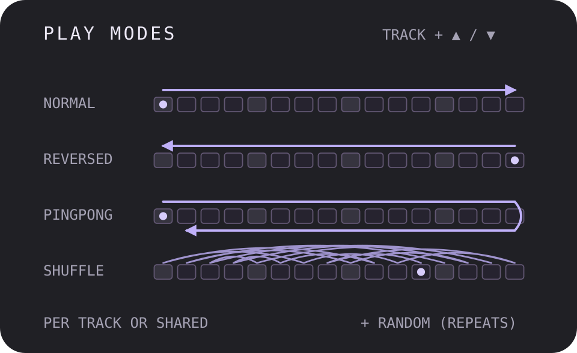

# Play Modes

Version: `0.1.0-experimental` · author: [@devilfish707](https://github.com/devilfish707)

The Octatrack sequencer's playhead in five directions, shared by every track
or set per track. ColdFire-only (no DSP code), for original OS 1.40C.

**Experimental.** Built into test images and played on the author's MKII
(builds 12–16, 3 Oct 2026); per-pattern modes and the project save are not played yet. Not stress-tested. See [TESTING.md](TESTING.md).

## Overview

| mode | 16 steps play as |
|---|---|
| NORMAL | 1 2 3 … 16, 1 2 3 … (stock) |
| REVERSED | 16 15 14 … 1, 16 15 … |
| PINGPONG | 1 … 16 15 … 2, 1 … 16 15 … 2: the end steps play once |
| RANDOM | any step each time; a step can repeat |
| SHUFFLE | every step once per pass, in a new order every pass |

With the pattern's SCALE MODE on NORMAL, one mode is shared by every track,
and RANDOM / SHUFFLE move all tracks through the same order. With SCALE MODE
on PER TRACK, each track has its own: T1–T8 and the MIDI tracks M1–M8.
Switching SCALE MODE back keeps both: the shared mode returns, and the
per-track modes wait for the next PER TRACK pattern.

The stock playhead keeps counting as always; the module only decides which
step plays at each position. Everything a step carries moves with it: its
trig or trigless trig, trig condition, micro-timing, swing bit and
parameter locks. Tempo, track length and scale, the pattern end, chains and
CHAIN AFTER stay stock. The trig LEDs, live recording and lock editing
follow the step you hear.

## Controls

| action | result |
|---|---|
| hold [TRACK n], press [UP] | the mode one row up the list (towards NORMAL) |
| hold [TRACK n], press [DOWN] | the mode one row down (towards SHUFFLE) |

The list is NORMAL, REVERSED, PINGPONG, RANDOM, SHUFFLE and does not wrap.
A one-second popup shows the result: `ALL PINGPONG` under NORMAL scale mode
(any TRACK key changes the shared mode), `T3 PINGPONG` or `M2 REVERSED`
under PER TRACK. Default NORMAL. Changing the mode, playing or stopped,
takes effect from the next step.

## Per pattern, saved with the project

Every pattern has its own modes: set REVERSED on A01 and PINGPONG on A02,
and each plays its own when you switch between them (also in a chain). The
popup and the TRACK + arrow keys work on the pattern that is playing.

The modes are part of the project. They are written to `project.work` as
one line per pattern that is not all NORMAL, `#PLAY_MODES=A01:` and 17
digits (the shared mode, T1–T8, M1–M8; 0 NORMAL … 4 SHUFFLE), whenever the
Octatrack writes the project's settings: PROJECT > SAVE (which copies it to
`project.strd`), SYNC TO CARD, and PROJECT > CHANGE. Loading or reloading a
project sets them from those lines; a project without them (older, or saved
on stock firmware) loads as all NORMAL. Build 17's single line is read as
every pattern's. Only the modes are saved: every track still starts from
its first step.

They also survive a power cycle, like CHAIN AFTER: the whole table, every
pattern of every bank, is kept in battery-backed RAM.

Copying a pattern (FUNC + REC) and pasting it (FUNC + STOP) takes its modes
along, and undoing a paste brings the old ones back. Clearing a pattern
(FUNC + PLAY) sets all its modes back to NORMAL.

Stock firmware reads the lines as comments and ignores them, so these
projects still open on a stock OS (and lose the lines at their next save
there).

## Usage

- REVERSED on a melodic MIDI track turns a phrase backwards without
  re-programming it.
- PINGPONG on a sliced break plays it out and back: 30 steps of material
  from 16.
- SHUFFLE keeps every hit of a groove but re-orders it every pass; RANDOM
  lets steps repeat and others drop out.
- With PER TRACK scale mode and different lengths, a 5-step PINGPONG hat
  against a 16-step NORMAL kick drifts in and out of phase.

PLAY and every pattern change start each track from its first step again
(REVERSED from its last) and draw a new RANDOM / SHUFFLE order.

## Quick tutorial

1. Load a pattern with a trig on step 1 only; SCALE MODE NORMAL.
2. Hold [TRACK 1], press [DOWN] once: `ALL REVERSED`. Press PLAY: the trig
   now sounds on the last step of every bar, and the trig LEDs walk 16 → 1.
3. Hold [TRACK 1], press [DOWN] once more: `ALL PINGPONG`; hold it and press
   [UP] twice to return to `ALL NORMAL`.

## PER TRACK scale mode and MASTER LENGTH

MASTER LENGTH restarts every track after that many master steps (the
Octatrack default is 16), so a 20-step track never gets past step 16 in any
play mode. Each play mode works on the steps a track actually reaches
before that restart: REVERSED then plays 16 → 1, the mirror of what NORMAL
plays. Set MASTER LENGTH to INF to let each track run its full length.

With MASTER LENGTH at INF a pattern never reaches its end, so a queued
pattern change waits for CHAIN AFTER. A pattern on USE PAT SET. with
PAT.LEN never changes: choose USE PRJ SET. in its PATTERN SETTINGS (or give
it its own CHAIN AFTER length). This is stock behaviour.

## Compatibility and limitations

- Base: original OS 1.40C. Played on an MKII; the MKI shares the sequencer
  and key map layout but is untested.
- PROJECT > NEW may keep the previous project's modes (untested).
- Copying a single track does not copy that track's mode.
- Does not combine with PLOCKS P2: both use the same battery RAM and the
  same pattern-copy sites (the remixer refuses the pair).
- Composes with EUCLID and SCALE QUANTIZER by design (their stubs return
  into this module's sites). DIRECT JUMP, OCTAKIT and the KYOTI modules hook the same tick
  handler at other sites; combinations are untested.
- Swing follows the step that plays (stock reads the swing bit of the step
  it is given). Trig conditions keep counting stock passes.
- Like every DRAM module, the test image gives up about 10 MB of sample
  memory to the platform reserve.

## Building

See the repository [README](../README.md). In short: copy this directory to
`sdk/octabam/modules/playmodes/` of an octamod (or octabam) checkout with a
local original 1.40C extraction, `python3 generate.py`, then build
`test-remix.py` as a remix.

## Tests and measurements

`python3 verify.py`: the engine (every mode for lengths 1–64, shuffle a
permutation every pass, random's spread, look-ahead equals what then plays,
what is prepared while stopped equals what PLAY plays, the popup text) and
the firmware glue (scale mode, per-track lengths, MASTER LENGTH cut, PLAY
and pattern-switch restarts, the project line and battery RAM) on the host. With `m68k-elf-gcc` on the PATH it
also compiles and assembles the ColdFire unit and refuses any call outside
it. Hardware results: [TESTING.md](TESTING.md).

## Files

| file | what |
|---|---|
| `playmode.h`, `playmode.c` | the engine: pure, freestanding C |
| `adapter.c` | firmware glue: sequencer bytes, restarts, lengths, popup text, per-pattern table, project lines, battery copy |
| `hooks.s` | the detour stubs (14 + the pattern-copy memcpy), the register-saving entries, DRAM state |
| `generate.py` | compiles and assembles the three into the linked unit `playmodes.s` |
| `verify.py`, `test_*.c` | host tests |
| `manifest.py` | native declaration: the unit and its detours, each guarded by stock bytes |
| `test-remix.py` | the test image: PLAY MODES on the stock effects |
| `investigate.py`, `INVESTIGATION.md` | the local firmware probe and what it found |

## Authorship and licences

Original code and illustration by devilfish707, MIT ([LICENSE](LICENSE)).
Firmware addresses are cited from octabam (Sam Banks), SCALE QUANTIZER and
DIRECT JUMP (Tim Hastie), the KYOTI firmware notes (Zac-Kyoti) and OctaKit
(June Kiff), and read from the author's own 1.40C with `investigate.py`.
No Elektron code, tables or images are included.

## Screens and audio

None yet. The thumbnail is an illustration, not an Octatrack screen.
